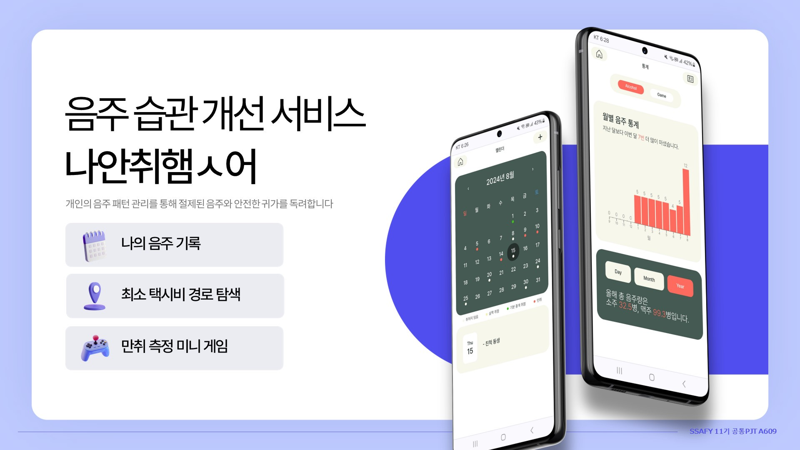

# 📆 [음주 습관 개선 서비스] 나안취햄ㅅ어

# [1] About the Project

## 📌 **주제**

개인의 음주 패턴을 관리해 **절제된 음주**와 **안전한 귀가**를 독려하기 위한 음주 습관 개선 서비스

## 🔧 메인 기능

### 📅 **나의 음주 기록**

- 일정 별 **음주량, 만취 정도 피드백** 기록, 4가지 색상으로 구분해 **일정별 만취 정도** 파악 가능
- 만취 게임, 경로 찾기 기능과 연동되어 **게임 점수, 귀가 시간도 기록** 가능
- 지난 12개월간 월별 음주 횟수, 일별/월별 평균 음주량 평균, 연간 총 음주량을 **시각화**한 통계

### 🚓 **최저 택시비 경로 계산**

- 출발지(기본값=현재 위치 자동 입력), 목적지 주소 검색 시 자동완성 검색
- **최적 경로 탐색**
- **실시간 현재 위치 확인**(백그라운드 앱 실행으로 실시간 GPS 위치 추적 가능)
- 목적지 근처 100m이내에서 위치 확인시, 해당하는 음주 일정이 있는 경우 **귀가 시간 자동 등록**

### 🎮 **만취 측정 미니 게임**

비틀거림, 발음 꼬임, 오타, 기억력 저하를 기준으로 게임 제작

#### **(1) 밸런스 게임**

- 휴대폰을 기울여 어미 오리를 이동해가면서 랜덤으로 배치된 새끼오리를 찾는 게임
- Device Orientation API를 활용해 웹 페이지가 모바일 장치의 가속도계를 활용해 **실시간으로 장치의 기울기 정보를 감지**

#### **(2) 발음 게임**

- 주어진 랜덤 문장을 읽어서 발음 정확도를 판단하는 게임
- 한국 전자통신 연구원의 발음도 정확도 판단 API를 활용했고, 이에 필요한 WAV형식, 160k주파수 등의 조건을 맞추기 위해 recordRTC 라이브러리로 녹음파일을 변환

#### **(3) 타이핑 게임**

- 20초 내에 주어진 랜덤 문장을 따라 타이핑하는 게임
- 전체 글자수 대비 일치하는 글자수를 기준으로 점수를 환산, 제한 시간 초과시, 현재 입력값을 기준으로 점수에 반영

#### **(4) 카드 맞추기 게임**

- 5초간 카드 전체 이미지를 확인후, 20초동안 동일한 이미지의 6쌍의 카드를 찾는 게임
- 만약 틀릴 시 -1점 감점 존재하며, 제한 시간 초과시, 현재 입력값을 기준으로 점수에 반영

# [2] Usage

## 💻 초기 화면

- 서비스 접속 초기화면으로 다음 페이지가 나타납니다.
- 로그인이 되어 있지 않은 경우: 우측 상단 로그인/회원가입 버튼 표시
- 로그인이 되어 있는 경우: 우측 상단 마이페이지 버튼 표시

<table>
  <tr>
    <td>
    
        </td>
    <td>
    
        </td>
  </tr>
</table>

## 😀 프로필

- 사용자의 프로필 정보(이름,닉네임,이메일,연락처,주량,주소,우편번호, 비상연락망) 정보를 저장합니다.
- 해당 페이지에서 회원 탈퇴, 로그아웃, 비밀번호 변경이 가능합니다.
- 사용자의 프로필 정보 중 이름, 이메일을 제외한 모든 정보는 수정이 가능합니다.

<table><tr><td>

</td>
<td>

</td>
<td>

</td></tr></table>

## 📊 음주 및 게임 기록 통계

- 사용자의 캘린더에 입력된 정보를 기반으로 음주 통계를 제공합니다.
- 음주 기록은 월별 음주 통계, 월별/일별 평균 음주량, 올해 총 음주량을 제공합니다.
- 게임 기록은 4가지 게임별 사용자의 전체 점수 평균, 이번달 점수 평균을 그래프로 제공합니다.
- 월별, 연도별 전체 점수 평균보다 낮은 점수인 경우를 구해 평균보다 과음한 일수를 구합니다.

<table>
<tr>
<td>
  
</td>
<td>
  
</td>
</tr>
</table>

## 🎮 미니 게임

- 만취 정도를 판단하기 위한 네가지 미니 게임(발음 게임, 밸런스 게임, 타이핑 게임, 기억력 게임)이 있습니다.
- 게임을 진행하면 해당 날짜에 사용자가 등록한 일정이 있는지 확인합니다. 등록된 일정이 있다면 게임 기록이 자동으로 저장되고, 등록된 일정이 없다면 술을 마시고 있는지 확인합니다.
- 술을 마시고 있다면 일정을 생성하고 해당 일정에 게임 기록을 저장합니다.

<table>
<tr>
<td>
    
</td>
<td>
    
</td>
<td>
    
</td>
<td>
    
</td>
</tr>
  </table>

### 발음 게임

- 랜덤 문장을 읽고 이에 따른 발음 정확도를 점수로 계산합니다.
- 한국전자통신연구원의 발음도 정확도 판단 API를 활용했고, 이에 필요한 WAV 형식, 160K 주파수 등의 조건을 맞추기 위해 recordRTC 라이브러리로 녹음 파일을 변환합니다.

<table><tr><td>
   
</td></tr></table>

### 밸런스 게임

- 모바일 장치를 기울여 어미오리를 움직여서 랜덤 배치된 새끼 오리를 찾습니다.
- Device오리엔테이션 API를 통해 모바일 장치의 가속도계를 활용해 실시간으로 장치의 기울기 정보를 감지합니다.

<table><tr><td>
   
</td></tr></table>

### 타이핑 게임

- 랜덤으로 주어진 문장을 타이핑해서 전체 글자수 대비 일치하는 글자수를 기준으로 점수를 환산합니다.

<table><tr><td>
   
</td></tr></table>

### 기억력 게임

- 20초의 제한시간 내에 동일한 이미지의 6쌍의 카드를 얼마나 찾을 수 있는지를 점수로 계산합니다.

<table><tr><td>
   
</td></tr></table>

## 음주 기록 캘린더

- 음주 일정을 확인합니다. 취한 정도에 따라 색상을 다르게 표시합니다. 해당 날짜 일정을 모아볼 수 있습니다.

<table>
<tr>
<td>
    
</td>
<td>
    
</td>
<td>    
    
</td>
<td>    
    
</td>
</tr>
</table>

- 일정은 캘린더에서 미리 등록하거나, 미니 게임 시 기록 저장을 위해 등록할 수 있습니다.

<table>
<tr>
<td>
    
</td>
<td>
    
</td>
<td>    
    
</td>
<td>
    
    </td>
    </tr>
    </table>

- 등록된 일정을 수정할 수 있습니다.

<table><tr><td>
    
</td></tr></table>

- 끝난 일정에 대해 피드백을 등록할 수 있습니다. 해당 일정에서의 음주량을 기록합니다.

<table><tr><td>
    
</td></tr></table>

## 🚓 최소 택시비 경로 찾기

- GPS를 이용해 자동으로 현재 위치를 출발 위치로 설정할 수 있습니다.
- 구글맵 API를 이용하여 정확한 위치 정보를 받아옵니다.

<table>
<tr>
<td>
    
    </td>
<td>
    
    </td>
<td>
    
    </td>
    </tr>
</table>

- 오디세이 API에서 추천경로 데이터(기존 경로탐색에서 볼 수 있는 것과 같음)를 제공 받고, GTFS 데이터셋을 활용하여 막차가 끊기는 지점부터 다시 남아있는 노선을 확인해 도착지까지 가까이 갈 수 있는 경로를 구합니다.
  그 마지막 위치를 기준으로 카카오 모빌리티 API를 활용해 택시비 정보를 받아와서 사용자는 최종 추천 경로를 제공받습니다.

<table>
<tr>
<td>
    
</td>
<td>    
    
</td>
<td>    
    
</td>
</tr>
</table>

- 사용자의 실시간 위치를 지속적으로 파악합니다.
- 도착지에 도착하면 24시간 내 일정이 있었는지 확인하고 가장 가까운 일정에 도착 시간이 자동으로 기록됩니다.

 

# [3] Contribution

[`contributing guide`][contribution-url]를 참고해주세요. 버그 수정에는 bugfix를, 기능 구현에는 feat을 사용할 수 있습니다.

 

# [4] Acknowledgement

## Frontend

- [코딩 컨벤션 참고](https://ui.toast.com/fe-guide/ko_CODING-CONVENTION)
- [TanStack Query(aka. react query) 에서 자주 사용되는 개념 정리](https://github.com/ssi02014/react-query-tutorial?tab=readme-ov-file#react-query-%EA%B8%B0%EB%B3%B8-%EC%84%A4%EC%A0%95)
- [React Native Global Styles](https://stackoverflow.com/questions/30853178/react-native-global-styles)
- [useEffect가 아닌 useFocusEffect 사용하여 stack 구조 화면 초기화하기](https://velog.io/@skyu_dev/React-Navigation-Bottom-Tab%EC%9D%98-Require-cycle-warning-%ED%95%B4%EA%B2%B0%ED%95%98%EA%B8%B0)
- [react-native-google-autocomplete를 이용해서 위치 자동완성 기능 만들기](https://velog.io/@acwell94/React-Native-react-native-google-autocomplete%EB%A5%BC-%EC%9D%B4%EC%9A%A9%ED%95%B4%EC%84%9C-%EC%9C%84%EC%B9%98-%EC%9E%90%EB%8F%99%EC%99%84%EC%84%B1-%EA%B8%B0%EB%8A%A5-%EB%A7%8C%EB%93%A4%EA%B8%B0)
- [가속도 센서를 이용해 움직이는 View 만들기](https://velog.io/@jshme/falling-view-using-accelerometer-sensor)

## Backend

- [Spring Boot ResponseDto 응답 형태](https://velog.io/@faulty337/Spring-Boot-ResponseDto%EA%B0%80-%ED%95%84%EC%9A%94%ED%95%A0%EA%B9%8C)
- [Custom Response 생성하기](https://velog.io/@baekgom/Custom-Response-%EC%83%9D%EC%84%B1%ED%95%98%EA%B8%B0)
- [dto의 toEntity를 어떻게 사용해야할까?](https://hangjastar.tistory.com/246)
- [Dto와 Entity를 분리하는 이유, 분리하는 방법](https://velog.io/@0sunset0/Dto와-Entity를-분리하는-이유-분리하는-방법)
- [빌더 패턴의 권장 이유](https://devfunny.tistory.com/337)
- [Builder Pattern : 장단점](https://kangworld.tistory.com/246)
- [Docker의 IPTABLES 접근](https://security-gom.tistory.com/65)
- [hibernate의 ddl-auto 속성의 종류와 주의해야할 점](https://colabear754.tistory.com/136)
- [Spring Data JPA 는 어떻게 interface 만으로도 동작할까? (feat. reflection, proxy)](https://pingpongdev.tistory.com/25)
- [Spring Boot JPA 사용하여 회원가입 구현하기](https://gh402.tistory.com/36)
- [Spring Guide - Directory 패키지 구조 가이드](https://cheese10yun.github.io/spring-guide-directory/)
- [Spring Boot JPA 사용하여 회원가입 구현하기](https://cheese10yun.github.io/spring-guide-directory/)
- [ETRI 공공 인공지능 오픈 API 발음 교정 - ETRI API 발음 평가 사용법](https://jee00609.github.io//pronunciationcorrection/pronunciationCorrection-ETRIAPI-Error/)
- [[JAVA] WAV 파일을 RAW Data 로 변환 및 저장하기 (Wav to Raw) ](https://jee00609.github.io//java/how-convert-wav-to-raw2/)

 

## 🔨 기술 스택

### Back-end

### Front-end

 

### Version

| Back-end      | Version            | Front-end      | Version |
| ------------- | ------------------ | -------------- | ------- |
| JDK           | 21                 | React          | 18.3.1  |
| Gradle        | 8.7.0-jdk21-alpine | Vite           | 5.3.4   |
| NginX         | 1.21.4             | React Native   | 0.74.3  |
| Jenkins       | 2.452.3            | Expo           | 51.0.23 |
| Spring Boot   | 3.3.1              | Node           | 20.15.0 |
| MySQL         | 9.0.1              | Eslint         | 8.57.0  |
| Docker        | 27.1.1             | tanstack-query | 5.51.11 |
| Ubuntu        | 20.04.6            | VS Code        | 1.92.1  |
| IntelliJ IDEA | 2024.1.4           | Zustand        | 4.5.4   |
| Redis         | 7.4.0              | JWT decode     | 4.0.0   |

# [6] :email: Contact

### 📧 나안취햄ㅅ어 공식 이메일: imnotdurnk.ssafy@gmail.com

### 📧 팀원 이메일

|  **이름**  |  **포지션**  |        **이메일**        |
| :--------: | :----------: | :----------------------: |
| **박희연** | **Frontend** |   godeeyeon@gmail.com    |
| **이나연** | **Frontend** |  naye07@g.hongik.ac.kr   |
| **정상영** | **Frontend** | jeongsangyoung@naver.com |
| **박다솔** | **Backend**  |     ds10x2@gmail.com     |
| **육예진** | **Backend**  |   yukyj0418@gmail.com    |
| **정여진** | **Backend**  |   yeojin9905@naver.com   |

<!-- url -->

[contribution-url]: CONTRIBUTION.md
